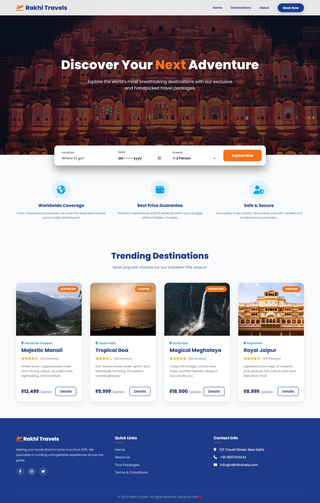

# 🌍 Rakhi Travels - Landing Page


## 📌 Project Title

Rakhi Travels - Responsive Travel Landing Page


## 📖 Description

This is a responsive travel landing page developed using HTML5 and CSS3. It showcases popular travel destinations, premium travel packages, and a modern user interface. The website is designed to provide users with an attractive browsing experience.


## 🚀 Features

- Responsive Design

- Fixed Navigation Bar

- Hero Section

- Search Bar

- Travel Destination Cards

- Hover Effects

- Mobile Friendly Layout

- Attractive Footer


## 🛠️ Technologies Used

- HTML5

- CSS3

- Google Fonts

- Font Awesome


## 📂 Project Files

- index.html

- README.md

- goa.jpg

- hawa_mahal.jpg

- jaipur.jpg

- manali.jpg

- meghalaya.jpg

- screenshot.png


## 📸 Screenshot


```md



```


## 👨‍💻 Author


Mahak Ojha


## 📚 Internship


Oasis Infobyte (OIBSIP) - Web Development and Designing Internship


## 📄 License


This project is created for educational purposes only. 🌍 Rakhi Travels - Landing Page
