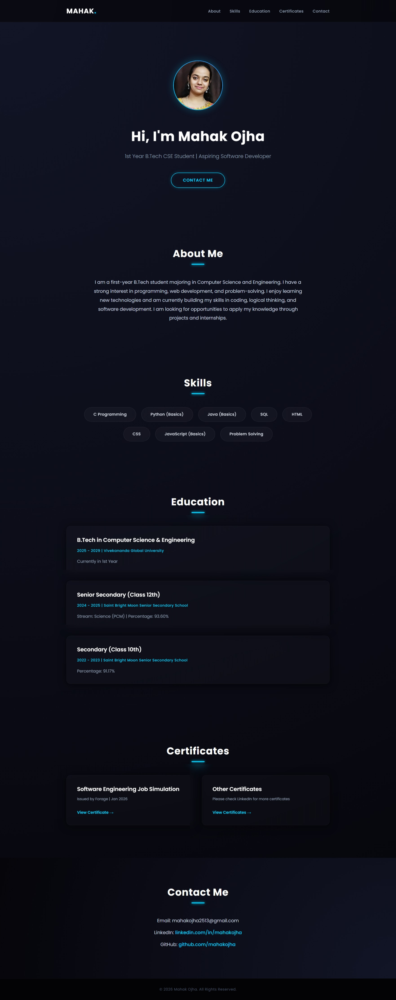

# 💼 Mahak Ojha - Personal Portfolio

## 📌 OIBSIP Web Development and Designing Internship

**Level:** Level 1  
**Task:** Task 2 - Personal Portfolio

## 📖 Description

This project is a responsive personal portfolio website developed using HTML5 and CSS3. It showcases my profile, skills, education, certificates, and contact information with a modern and attractive user interface.

## 🚀 Features

- Responsive Design
- Modern Navigation Bar
- Hero Section
- About Me Section
- Skills Section
- Education Section
- Certificates Section
- Contact Section
- Smooth Scrolling
- Attractive UI with Animations

## 🛠️ Technologies Used

- HTML5
- CSS3
- Google Fonts (Poppins)

## 📂 Project Files

- index.html
- image.png
- screenshot.jpeg
- README.md

## 📸 Screenshot

## 👩‍💻 Author

**Mahak Ojha**

## 🎯 Internship

Oasis Infobyte (OIBSIP) - Web Development and Designing Internship

## 📄 License

This project is created for educational purposes only.
