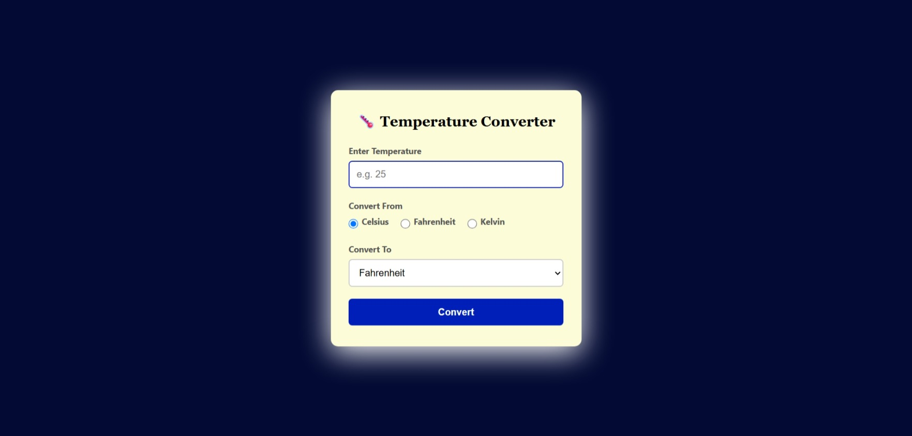

# 🌡️ Temperature Converter Website

## 📌 OIBSIP Web Development and Designing Internship

**Level:** Level 1  
**Task:** Task 3 - Temperature Converter Website

## 📖 Description
This is a responsive Temperature Converter website developed using HTML, CSS, and JavaScript. It allows users to convert temperatures between Celsius, Fahrenheit, and Kelvin with real-time calculations and input validation.

## ✨ Features
- Responsive Design
- Convert Celsius, Fahrenheit, and Kelvin
- Input Validation
- Absolute Zero Validation
- Instant Conversion
- User-Friendly Interface
- Clean and Modern UI

## 🛠️ Technologies Used
- HTML5
- CSS3
- JavaScript

## 📂 Project Files
- index.html
- README.md
- screenshot.jpeg

## 📸 Screenshot

## 👩‍💻 Author
**Mahak Ojha**

## 🎯 Internship
Oasis Infobyte (OIBSIP) - Web Development and Designing Internship

## 📄 License
This project is created for educational purposes only.
